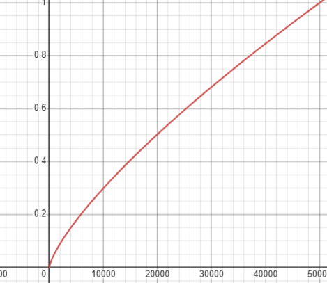

# Sentiment analysis using RNN

- sentiment analysis model , for movie reviews using LSTM
- first layer of the model is the embedding layer which carries the vector representation of the words
- the embedding layer is trained separately using skip-gram technique after data preprocessing in
  the [skip gram notebook](./notebooks/Skip_Gram.ipynb)
- then the full model (embedding layer + LSTM ) trained in
  the [sentiment analysis notebook](./notebooks/sentiment_analysis.ipynb)
- the notebooks show just the training process and the data preprocessing using moduls exists in [src folder](./src)
  <br><br>
  

# usage
## direct usage
- use it for inferences only 
- `pip install git+https://github.com/ahmedbadr97/sentiment-analysis-RNN`
```python
import sentiment_analysis
# this will load the model and download model weights for the first time only
sentiment_analysis.load_model()

# after loading the model use it as you want
review_txt="i love this movie , this is an example for clarification"
# returns the probability of the review of being positive 0 to 1
positive_probability =sentiment_analysis.predict(review_txt)
```
## train and use
- clone the repo
- requirements
  - [train tracker](https://github.com/ahmedbadr97/train-tracker/tree/main/src/traintracker)
  - `[pandas,matplotlib,torch,sklearn,gdown]`
# Skip-gram model

- Skip-gram is one of the unsupervised learning techniques used to find the most related words for a given word.
  Skip-gram is used to predict the context word for a given target word.
- I used skip gram technique for the embedding layer to get a vector representation for each word in the review
- all the following sections are in the [skip gram notebook](./notebooks/Skip_Gram.ipynb) covered in detail

## Data loading

- load and view the reviews' dataset before the preprocessing
- the reviews and the labels each of them exists in a text file and separated by new line character
    - `reviews.txt , labels.txt`

```
no of unique words=381542
no of words =9253570
```

## Data preprocessing

### remove invalid words

- remove punctuations , set all chars to lowercase , remove html tags

### calculate word importance

- calculate word importance `log(word in positive / word count in negative` to put the word importance in account while
  removing words

```
common words
------------
pos and negative ratio for 'the' 0.15040138861478275
pos and negative ratio for 'him' 0.23241749635693773
pos and negative ratio for 'her' 0.24583923387574738
pos and negative ratio for 'is' 0.12302609115914889
pos and negative ratio for 'they' -0.2687558382621351
pos and negative ratio for 'did' -0.2160042141353108
pos and negative ratio for 'as' 0.23724039177675732
pos and negative ratio for 'a' 0.037063342877560294

Postive words
-------------
pos and negative ratio for 'wonderful' 1.5571694838883434
pos and negative ratio for 'amazing' 1.343095156017315
pos and negative ratio for 'good' 0.005656862045491339
pos and negative ratio for 'excellent' 1.4842294169777621

negative words
--------------
pos and negative ratio for 'bad' -1.362353199221966
pos and negative ratio for 'worse' -1.6799782168127269
pos and negative ratio for 'boring' -1.5131861129745143

```

### remove words with high and low freq

- Words that show up often such as "the", "of", and "for" don't provide much context to the nearby words. If we discard
  some of them, we can remove some noise from our data and in return get faster training and better representations.
- remove words that have low frequency less than 20 that may be misspelling or irrelevant word that doesn't add too much
  meaning for the review to be positive or negative
  <br><br>
  **probability of word removal**
  <br><br>
- This process is called subsampling by Mikolov.For each word wi) in the training set,
- we'll discard it with probability given by
- 
- p--> probability of discarding word
- t--> threshold of word count that the probability of discarding will begin to increase from `T/t`
- f--> frequency of a word
- T--> total number of words
- `set t=100 and T=500000=1e5 ` probability of removal will start to be grater than zero when the f=5000
- 
  <br><br>

### data after preprocessing

- finally, save the preprocessed data

```
no of unique words=17943
no of words =5189833
```

- no of unique words decreased from  `381542` to `17943`
- no of words decreased from `9253570` to `5189833`

#### sample before and after

- <u>review before</u> <br>

    - Christopher Lee is one of my favorite actors! I'm trying to view all of his work. He has been known to
      single-handedly save movies with his presence. Unfortunately, this is not one of them. This movie suffers from a
      low budget and it's production values are disturbing. Please...for the love of Christopher....avoid this film!
      <br><br>
- <u>review after</u>

    - christopher lee my favorite actors im trying view his work been known singlehandedly save movies his presence
      unfortunately them movie suffers low budget production values disturbing love

## Skip-gram data loader

- Dataset Loader will load the txt data
- count the frequency for each word and total frequency which used in selecting the noise words which doesn't appear in
  the word context
- save a map for word to index and index to word , change txt to int
- iterate over the data , return each iteration `(input,target,noise_words)` the target which is the no of words around
  the given word with size `w` and the input will be the word repeated `w` times
    - ex if the txt is
    - ` They celebrated his birthday with a big party.`
    - and we are at the word `birthday` and the window size = 2 , select 2 from right , 2 from left
    - input `[birthday,birthday,birthday,birthday]` target `[celebrated,his,with,a] `

### selecting noise word

- we will select from a probability distribution (probability of selecting a word as noise word) n-words
  <br><br>
- 
- 
  <br><br>
- `f--> word frequency`
- `t--> total of words frequencies`
- with a power of `3/8` will make the probability of selecting low frequent words little higher
  <br><br>
- 
- 

## Training

### feed-forward process

- for window size=3 , batch_size=2
- txt --> `[1,2,3,4,5,6,7,8,9,10]` after being changed from txt to int
- take input of an index of a word repeated with window_size*2
- example at word 4

```
           batch 1       batch 2
input  [ 4,4,4,4,4,4, 5,5,5,5,5,5 ]
target [ 1,2,3,5,6,7, 2,3,4,6,7,8 ]
```

- for each input list random noise n-words will be selected

### loss function

- 
  <br><br>

- Dot product between input word and random words need to be minimized to zero
    - 
      <br><br>
- selection or random words will be done using uni-gram distribution for the word
- Dot product between input word and output word need to be maximized to be zero also
  <br><br>
    - 

### train process tracking

- I used the train tracker package in my GitHub
  repos [train tracker](https://github.com/ahmedbadr97/train-tracker/tree/main/src/traintracker)
- train tracker tracks the model hyperparameters if i changed any hyperparameter it adds a row in train_data csv file with
  the new hyperparameters and the starting epoch idx of beginning of using this hyperparameters
- also saves model weights if the loss decreased , and saves the epoch data \[train loss,test loss,data size , training time]
- best results at the sentiment analysis section was on the last two intervals of training starting from epoch 115
- 
- all the history exists in [train tracker directory](./train_tracker)
  - [train_data.csv](./train_tracker/train_data.csv)
    - has the change of the hyperparameters during training
  - [epochs_data.csv](./train_tracker/epochs_data.csv)
    - has the train and test losses 
## model results
- this is random words and top 5 closest words to this words
```
too | very, pretty, overly, bit, enough
plot | storyline, story, premise, script, narrative
how | why, really, where, mean, believe
bad | awful, terrible, good, horrible, badbr
two | three, four, couple, 2, 3
such | truly, many, example, kind, great
time | timebr, spent, week, hour, day
love | hate, loved, friendship, loves, romantic
convincing | believable, realistic, credible, effective, likable
biggest | major, big, greatest, worst, huge
intelligent | witty, smart, clever, mature, talented
filled | full, lots, plenty, contains, loaded
sadly | unfortunately, simply, shame, however, largely
kills | killing, killed, kill, dies, murdering
amount | amounts, lot, minuscule, lots, considerable
credit | kudos, deserves, award, praise, mention

```
# sentiment analysis full model
- the model will take the whole review as input and decide if it's a positive review or negative review
- data preprocessing done first at the Skip-grams model training

**Sections**
1. load and view the dataset
2. split the dataset and create dataset train loader
3. create the RNN model with embedding layer from trained skip-gram model
4. model training
5. evaluation and inferences

## Load and view Dataset
- we have reviews loaded form reviews.txt file and labels form labels.txt file and the word2int.json file which have words and their corresponding int value saved from skip gram model training
```
no of reviews 40000
no of labels 40000
```
### review lengths
- knowing the mean of the review length to make it fixed for training to be the sequence length for the RNN 
- after knowing the good fixed length for a review long reviews will be cut from right and short reviews will be padded with zeros from the left
- 
<br><br>
- 
<br><br>
- most of the reviews are around 500 word after ignoring 100 from the left and right
## Train test split
- load the reviews.txt and labels.txt , a line separated movie reviews and their corresponding labels are (`positive`,`negative`) for positive and negative reviews
- split the data to train and test with ratio 80 to 20 , save them in json file (`train.json`,`test.json`)
- each json file contains dict of two keys `reviews` is a list of the reviews and `labels` is a list of the labels for this reviews
```
train size 32000
test size 8000
```
## forward-process
- the model takes a review of a fixed length (sequence length) as input and hidden (short term and long term output for the last word in the review ) outputs of the lstm layer
- embedding layer outputs the vector representation for each word with embedding size as input-size for LSTM (bach_size,seq_length,embedding_dimension)
- output for the sequence of words discarded except the output for the last word which is taken as the review output <br><br>
- example for a review length =5 and batch dimension is ignored <br><br>
- 


## Model training
- train method exists in [model_training.py](./src/model_training.py)
- the model first load the embedding layer from the skip-gram model
- then the training starts with freezing the embedding layer and leaving the LSTM and fc to train for about 20 epochs to get the right weights without updating the embedding layer with learning rate 0.001
- then the model trained for another 20 epochs after un-freezing the embedding to make it tailored for the sentiment analysis with small learning rate 0.0001
- the model reached accuracy about 90%
- all the history exists in [train tracker directory](./train_tracker/sentiment_analysis)
  - [train_data.csv](./train_tracker/sentiment_analysis/train_data.csv)
    - has the change of the hyperparameters during training
  - [epochs_data.csv](./train_tracker/sentiment_analysis/epochs_data.csv)
    - has the train and test losses 
- [sent_train_curve.png](./readme_assets/sent_train_curve.png)
## model performance
- confusion matrix
- 
<br><br>
- [accuracy](./readme_assets/accuracy.JPG)

## inferences
- review 1
  - Somehow, this documentary about Miles manages to include very little music and no complete tunes. Though Miles appears in the film, 95% of the interviews are other folks, not Miles. There are huge chronological gaps, many aspects of his life (his childhood prodigy, his drug addiction) are skipped or glossed over, and you'll learn little about what made the man and his contribution to music so groundbreaking. Skip it.

```
actual label:negative
predicted probability:0.220807746052742
predicted label:negative
```
- review 2
  - Okay, I'll admit the casting in the film is REALLY strange--part of this is due to the plot, but I still had a bit of trouble believing Pierce Brosnan playing this lead (though he really did a pretty good job).\<br />\<br />It's based on a true story of an Englishman who went to live with the Canadian Indians in the early 20th century. He claimed to be a mixed blood Indian. He was, in fact, so successful and well thought of that people came from all over to hear his lectures and be taken on his wilderness treks--even though he was not a mixed blood Indian and all his knowledge was from books or faked! The movie centers on this and what occurred when the hoax was uncovered.<br /><br />The acting and settings were great and I really liked the film (once I suspended disbelief about Brosnan). It didn't get widespread distribution--probably because it was pretty cerebral--not a Bond film nor a romance--just a really odd film about a remarkable man.

```
actual label:positive
predicted probability:0.8889216780662537
predicted label:positive
```
